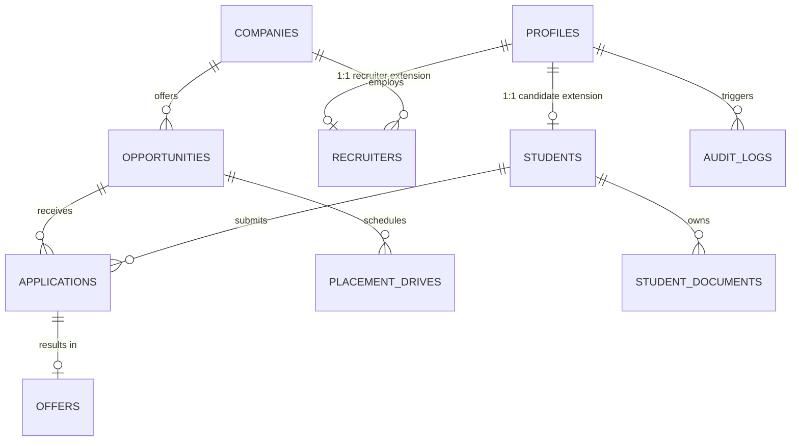

# RVU CAREER HUB — PLACEMENT CELL PORTAL ARCHITECTURE & USER GUIDE
**Target Route**: `/management/*`  
**Authoritative Role**: `placement` (Legacy Aliases: `management`, `placement-cell`, `CAR_ADMIN`)  
**Portal Name**: RV University Corporate Relations & Career Services (CRCS) Central Command  
**Document Version**: 2.0 (Production Live Database Integration)

---

## Table of Contents
1. [Executive Overview & Strategic Role](#1-executive-overview--strategic-role)
2. [Access Control & Security Architecture](#2-access-control--security-architecture)
3. [Information Architecture & Route Registry](#3-information-architecture--route-registry)
4. [Deep Dive: All 21 Portal Views & Functional Specifications](#4-deep-dive-all-21-portal-views--functional-specifications)
   - [4.1 Command Dashboard & Real-Time KPIs](#41-command-dashboard--real-time-kpis)
   - [4.2 Student Directory & Master Roster](#42-student-directory--master-roster)
   - [4.3 Student 360° Profile & Academic Audit](#43-student-360-profile--academic-audit)
   - [4.4 Bulk Excel/CSV Student Onboarding Engine](#44-bulk-excelcsv-student-onboarding-engine)
   - [4.5 Student Import History & Ingestion Audits](#45-student-import-history--ingestion-audits)
   - [4.6 Manual Student Provisioning](#46-manual-student-provisioning)
   - [4.7 Corporate Partner & Company Management](#47-corporate-partner--company-management)
   - [4.8 Recruiter Verification & Account Approvals](#48-recruiter-verification--account-approvals)
   - [4.9 Campus Placement Drives Coordination](#49-campus-placement-drives-coordination)
   - [4.10 Opportunity Moderation & Job Desk](#410-opportunity-moderation--job-desk)
   - [4.11 Central Application Tracking Pipeline](#411-central-application-tracking-pipeline)
   - [4.12 Interview Scheduling & Slot Management](#412-interview-scheduling--slot-management)
   - [4.13 Offer Letter Verification & Dream Policy Enforcement](#413-offer-letter-verification--dream-policy-enforcement)
   - [4.14 Broadcast Communications & Targeted Announcements](#414-broadcast-communications--targeted-announcements)
   - [4.15 Institutional Visual Analytics Dashboard](#415-institutional-visual-analytics-dashboard)
   - [4.16 Regulatory Compliance & Accreditation Reports (NIRF/NAAC)](#416-regulatory-compliance--accreditation-reports-nirfnaac)
   - [4.17 Resources, Handbooks & Policy Guidelines](#417-resources-handbooks--policy-guidelines)
   - [4.18 Student & Recruiter Support Grievance Desk](#418-student--recruiter-support-grievance-desk)
   - [4.19 Immutable Security Audit Trail](#419-immutable-security-audit-trail)
   - [4.20 Institutional Configuration & Policy Settings](#420-institutional-configuration--policy-settings)
   - [4.21 Placement AI & Private Knowledge RAG Desk](#421-placement-ai--private-knowledge-rag-desk)
5. [Backend Service Layer (`PlacementDataService`)](#5-backend-service-layer-placementdataservice)
6. [Database Schema & Entity Relationship Overview](#6-database-schema--entity-relationship-overview)
7. [User Interface Design & Brand Integration](#7-user-interface-design--brand-integration)
8. [Placement Officer Standard Operating Procedures (SOP)](#8-placement-officer-standard-operating-procedures-sop)

---

## 1. Executive Overview & Strategic Role

The **Placement Cell Portal** (`/management`) serves as the central mission control for RV University’s Department of Corporate Relations & Career Services (CRCS). Designed for placement directors, managers, career counselors, and administrative staff, the portal bridges students, recruiters, and university leadership.

### Key Capabilities:
- **Zero-Mock Production Data**: Fully bound to Supabase PostgreSQL schema with real-time reactive updates.
- **Unified Academic Roster**: Real-time sync of student academic progress, backlogs, CGPAs, and eligibility.
- **Enterprise Partner Vetting**: Strict verification gates for visiting corporates and hiring managers.
- **Campus Drive Command**: Live monitoring of on-campus and virtual hiring pipelines across preliminary tests, technical rounds, and HR interviews.
- **Offer Integrity & Anti-Hoarding**: Institutional validation of appointment letters and strict enforcement of RVU Dream & Super-Dream hiring rules.
- **Accreditation Readiness**: 1-click export of NAAC and NIRF placement tables with authentic audit trails.
- **Private AI RAG Engine**: Contextual search over internal MOUs, salary agreements, and placement bylaws.

---

## 2. Access Control & Security Architecture

### Role-Based Access Control (RBAC)
- **Role Identifier**: `placement`
- **Protected Route**: `/management/*`
- **Enforcement Component**: `<RoleRoute allowedRole="placement">` ([`RoleRoute.tsx`](file:///Users/gagan/.gemini/antigravity-ide/scratch/rvu-placement/src/components/auth/RoleRoute.tsx))

```
                    ┌────────────────────────────┐
                    │      Incoming Request      │
                    │       to /management       │
                    └─────────────┬──────────────┘
                                  │
                                  ▼
                    ┌────────────────────────────┐
                    │   Is Auth State Hydrated?  │
                    │   (!isInitialized || load) │
                    └──────┬──────────────┬──────┘
                           │              │
                    YES    │              │ NO
                           ▼              ▼
              ┌─────────────────────┐  ┌──────────────────────┐
              │  AuthLoadingScreen  │  │   Has Active User    │
              │  (Gold RVU Vector)  │  │     & Session?       │
              └─────────────────────┘  └──────┬────────┬──────┘
                                              │        │
                                         NO   │        │ YES
                                              ▼        ▼
                                       ┌──────────┐ ┌──────────────────┐
                                       │ Redirect │ │ Is profile.role  │
                                       │ to /login│ │  == 'placement'? │
                                       └──────────┘ └────┬────────┬────┘
                                                         │        │
                                                    NO   │        │ YES
                                                         ▼        ▼
                                                ┌────────────┐ ┌───────────────┐
                                                │ Redirect   │ │ ALLOW ACCESS  │
                                                │ to /student│ │ Management    │
                                                │or/recruiter│ │    Layout     │
                                                └────────────┘ └───────────────┘
```

### PostgreSQL Row-Level Security (RLS) Grants
Placement officers possess administrative privileges across all operational tables:
```sql
-- Placement Officers have full SELECT, INSERT, UPDATE, and DELETE privileges
CREATE POLICY "Placement universal access to students" 
ON public.students FOR ALL USING (
  EXISTS (SELECT 1 FROM public.profiles WHERE profiles.id = auth.uid() AND profiles.role = 'placement')
);

CREATE POLICY "Placement universal access to opportunities" 
ON public.opportunities FOR ALL USING (
  EXISTS (SELECT 1 FROM public.profiles WHERE profiles.id = auth.uid() AND profiles.role = 'placement')
);

CREATE POLICY "Placement universal access to offers" 
ON public.offers FOR ALL USING (
  EXISTS (SELECT 1 FROM public.profiles WHERE profiles.id = auth.uid() AND profiles.role = 'placement')
);
```

---

## 3. Information Architecture & Route Registry

All placement portal subroutes are rendered through [`ManagementLayout.tsx`](file:///Users/gagan/.gemini/antigravity-ide/scratch/rvu-placement/src/components/management/ManagementLayout.tsx):

| Route | View Component | Function |
| :--- | :--- | :--- |
| `/management` | `ManagementDashboardView` | Command dashboard with live KPIs, alerts & quick actions |
| `/management/students` | `StudentManagementView` | Master searchable roster with filters and cohort exports |
| `/management/students/:id` | `StudentDetail360View` | Complete single-student dossier (grades, applications, offers) |
| `/management/students/import` | `StudentImportView` | Bulk CSV/Excel student roster ingestion with column mapping |
| `/management/students/import-history` | `StudentImportHistoryView` | Audit log of past bulk student import batches |
| `/management/students/new` | `StudentManualCreateView` | Single-student manual onboarding form |
| `/management/companies` | `CompanyManagementView` | Corporate partner database, tiers, and verification |
| `/management/recruiters` | `RecruiterManagementView` | Hiring manager accounts & pending registration approvals |
| `/management/drives` | `DriveManagementView` | Campus placement drive scheduler & stage coordinator |
| `/management/opportunities` | `OpportunityManagementView` | Moderation desk for job & internship listings |
| `/management/applications` | `ApplicationManagementView` | University-wide student application tracker |
| `/management/interviews` | `InterviewManagementView` | Interview rounds, venue bookings & panel scheduler |
| `/management/offers` | `OfferManagementView` | Letter verification desk & multi-offer policy checks |
| `/management/announcements` | `AnnouncementsView` | Multi-channel broadcast communication tool |
| `/management/analytics` | `AnalyticsView` | Interactive charts for placement rates, CTCs & trends |
| `/management/reports` | `ReportsView` | Accreditation export center (NIRF, NAAC, Annual Reports) |
| `/management/resources` | `ResourcesManagementView` | Policy manuals, resume guides & company prep decks |
| `/management/support` | `SupportTicketsView` | Student/Recruiter grievance helpdesk & issue tracker |
| `/management/audit-log` | `AuditLogView` | Immutable security log of administrative actions |
| `/management/settings` | `SettingsView` | University rules, tier thresholds, cycle years, & email |
| `/management/rag-docs` | `PrivateDocsRagView` | Internal document vault for RVU Placement AI assistant |

---

## 4. Deep Dive: All 21 Portal Views & Functional Specifications

### 4.1 Command Dashboard & Real-Time KPIs
- **File**: [`ManagementDashboardView.tsx`](file:///Users/gagan/.gemini/antigravity-ide/scratch/rvu-placement/src/components/management/views/ManagementDashboardView.tsx)
- **Primary Metrics**:
  - **Overall Placement Percentage**: Tracked live across graduating cohorts.
  - **Highest Package Offered**: Highest verified CTC (e.g., ₹45.0 LPA).
  - **Average & Median CTC**: Institutional remuneration benchmarks.
  - **Participating Corporates**: Verified enterprise employers active this cycle.
  - **Active Drives**: On-going campus drives with upcoming deadlines or interview rounds.
- **Action Triggers**: One-click quick shortcuts for:
  - *Import Student Roster*
  - *Review Pending Recruiter Approvals*
  - *Schedule Placement Drive*
  - *Verify Pending Offer Letters*

### 4.2 Student Directory & Master Roster
- **File**: [`StudentManagementView.tsx`](file:///Users/gagan/.gemini/antigravity-ide/scratch/rvu-placement/src/components/management/views/StudentManagementView.tsx)
- **Search & Filters**:
  - Filter by **School**: School of Computer Science and Engineering (SOCSE), School of Business (SOB), School of Design (SOD), School of Law (SOL), School of Liberal Arts and Sciences (SOLAS).
  - Filter by **Passing Batch**: 2024, 2025, 2026.
  - Filter by **Placement Status**: `Eligible`, `Placed`, `Opted Out`, `Debarred`.
  - Filter by **CGPA Range**: Min/Max threshold filtering.
- **Actions**:
  - Export filtered cohort to Excel/CSV.
  - Batch eligibility modification.
  - Navigate directly to individual Student 360 view.

### 4.3 Student 360° Profile & Academic Audit
- **File**: [`StudentDetail360View.tsx`](file:///Users/gagan/.gemini/antigravity-ide/scratch/rvu-placement/src/components/management/views/StudentDetail360View.tsx)
- **Panels**:
  1. **Academic Records**: 10th %, 12th/Diploma %, Current Degree CGPA, Active Backlogs, History of Arrears.
  2. **Verified Documents**: Master resume PDF preview, semester grade cards, government IDs.
  3. **Applications Timeline**: History of jobs applied, shortlisted stages, and interview outcomes.
  4. **Offers Received**: Confirmed CTCs, designation, offer letters, and policy tier validation.
  5. **Admin Override**: Ability for authorized placement officers to update eligibility status with mandatory audit notes.

### 4.4 Bulk Excel/CSV Student Onboarding Engine
- **File**: [`StudentImportView.tsx`](file:///Users/gagan/.gemini/antigravity-ide/scratch/rvu-placement/src/components/management/views/StudentImportView.tsx)
- **Features**:
  - Drag-and-drop CSV or Excel `.xlsx` file upload.
  - **Smart Column Auto-Mapping**: Auto-detects columns such as `USN`, `Full Name`, `Email`, `School`, `Programme`, `CGPA`, `Phone`.
  - **Validation Engine**: Real-time pre-import checks flagging invalid email domains, duplicate student IDs, and out-of-range CGPAs.
  - **Commit Stage**: Transactional batch insertion into PostgreSQL `profiles` and `students` tables.

### 4.5 Student Import History & Ingestion Audits
- **File**: [`StudentImportHistoryView.tsx`](file:///Users/gagan/.gemini/antigravity-ide/scratch/rvu-placement/src/components/management/views/StudentImportHistoryView.tsx)
- Tracks historical import batches:
  - Timestamp, Filename, Uploader Name, Total Rows, Successfully Ingested Rows, Failed Rows.
  - Downloadable error logs for non-ingested records.

### 4.6 Manual Student Provisioning
- **File**: [`StudentManualCreateView.tsx`](file:///Users/gagan/.gemini/antigravity-ide/scratch/rvu-placement/src/components/management/views/StudentManualCreateView.tsx)
- Form interface for adding single transfer students or lateral entries:
  - Full personal details, institutional email (`@rvu.edu.in`), USN, school, branch, CGPA, graduation batch.

### 4.7 Corporate Partner & Company Management
- **File**: [`CompanyManagementView.tsx`](file:///Users/gagan/.gemini/antigravity-ide/scratch/rvu-placement/src/components/management/views/CompanyManagementView.tsx)
- **Tier Classification**:
  - *Tier 1 / Super Dream*: CTC $\ge$ ₹18.0 LPA
  - *Dream*: ₹9.0 LPA to ₹17.9 LPA
  - *Core / Regular*: $\le$ ₹8.9 LPA
- **Partner Details**: Industry, Head office, HR points of contact, MOU status, historical hire count, and active status toggle.

### 4.8 Recruiter Verification & Account Approvals
- **File**: [`RecruiterManagementView.tsx`](file:///Users/gagan/.gemini/antigravity-ide/scratch/rvu-placement/src/components/management/views/RecruiterManagementView.tsx)
- **Pending Approvals Queue**:
  - New corporate recruiters registering through `/register` or `/request-access` enter this approval queue.
  - Placement officers review company email domain, designation, and official LinkedIn profiles.
  - **Actions**: `Approve Access` (unlocks recruiter portal) or `Reject / Request Information`.

### 4.9 Campus Placement Drives Coordination
- **File**: [`DriveManagementView.tsx`](file:///Users/gagan/.gemini/antigravity-ide/scratch/rvu-placement/src/components/management/views/DriveManagementView.tsx)
- **Live Drive Workflow Management**:
  - Stage 1: Pre-Placement Talk (PPT) & Venue/Webinar details
  - Stage 2: Online Assessment / Aptitude Test & Shortlist
  - Stage 3: Group Discussion / Technical Round 1
  - Stage 4: Technical Round 2 / Leadership Round
  - Stage 5: HR Discussion & Final Results
- Real-time student candidate attendance checklist and stage progression.

### 4.10 Opportunity Moderation & Job Desk
- **File**: [`OpportunityManagementView.tsx`](file:///Users/gagan/.gemini/antigravity-ide/scratch/rvu-placement/src/components/management/views/OpportunityManagementView.tsx)
- **Moderation Desk**:
  - Review job descriptions, stipend, full-time CTC, bond conditions, and probation periods submitted by recruiters.
  - Set eligibility criteria (minimum CGPA, allowed schools, max backlogs).
  - Publish listing to eligible students with automated email/push notifications.

### 4.11 Central Application Tracking Pipeline
- **File**: [`ApplicationManagementView.tsx`](file:///Users/gagan/.gemini/antigravity-ide/scratch/rvu-placement/src/components/management/views/ApplicationManagementView.tsx)
- View the unified status of every application across the university:
  - Stages: `APPLIED`, `SHORTLISTED`, `IN_TEST`, `INTERVIEWING`, `OFFERED`, `REJECTED`, `WITHDRAWN`.
  - Batch export of student resume bundles formatted for recruiter sharing.

### 4.12 Interview Scheduling & Slot Management
- **File**: [`InterviewManagementView.tsx`](file:///Users/gagan/.gemini/antigravity-ide/scratch/rvu-placement/src/components/management/views/InterviewManagementView.tsx)
- **Features**:
  - Calendar agenda view of upcoming interviews.
  - Meeting link generation (Google Meet / Zoom / On-campus lab rooms).
  - Automatic student slot allocation preventing clash with academic examinations.

### 4.13 Offer Letter Verification & Dream Policy Enforcement
- **File**: [`OfferManagementView.tsx`](file:///Users/gagan/.gemini/antigravity-ide/scratch/rvu-placement/src/components/management/views/OfferManagementView.tsx)
- **Institutional Gate**:
  - Recruiter uploads offer details and letter.
  - Offer remains `PENDING_VERIFICATION` until verified by the Placement Officer.
  - Placement Officer verifies CTC breakup (fixed vs variable vs ESOPs), joining location, and role.
  - **Policy Enforcement**: Automatically checks if student already has an active offer. Enforces RVU rules (e.g., student with Core offer can only accept Dream or Super Dream offer).

### 4.14 Broadcast Communications & Targeted Announcements
- **File**: [`AnnouncementsView.tsx`](file:///Users/gagan/.gemini/antigravity-ide/scratch/rvu-placement/src/components/management/views/AnnouncementsView.tsx)
- Targeted broadcast engine:
  - Audiences: All Registered Students, Unplaced Students Only, Specific School (e.g., SOCSE 2025), or Shortlisted Candidates for a specific company drive.
  - Delivery Channels: In-Portal Banner, System Notification, Broadcast Email.

### 4.15 Institutional Visual Analytics Dashboard
- **File**: [`AnalyticsView.tsx`](file:///Users/gagan/.gemini/antigravity-ide/scratch/rvu-placement/src/components/management/views/AnalyticsView.tsx)
- Visual metrics charts:
  - **Placement Conversion by School**: Side-by-side performance comparison.
  - **CTC Compensation Histogram**: Distribution bands (<₹6LPA, ₹6-10LPA, ₹10-15LPA, ₹15-25LPA, ₹25LPA+).
  - **Gender Diversity Placement Ratio**: Equal opportunity tracking.
  - **Top Recruiting Partners**: Ranked by number of offers and aggregate compensation.

### 4.16 Regulatory Compliance & Accreditation Reports (NIRF/NAAC)
- **File**: [`ReportsView.tsx`](file:///Users/gagan/.gemini/antigravity-ide/scratch/rvu-placement/src/components/management/views/ReportsView.tsx)
- Automated report generation:
  - **NIRF Data Table 1**: Number of graduating students, students placed, median salary.
  - **NAAC Criterion 5.2.1**: Percentage of placement of outgoing students.
  - **Annual Placement Summary**: PDF/Excel bundle for the Academic Council and Board of Management.

### 4.17 Resources, Handbooks & Policy Guidelines
- **File**: [`ResourcesManagementView.tsx`](file:///Users/gagan/.gemini/antigravity-ide/scratch/rvu-placement/src/components/management/views/ResourcesManagementView.tsx)
- Repository of institutional guidelines:
  - RVU Official Placement Policy Handbook
  - Standardized LaTeX and Word Resume Templates
  - Code of Conduct for Campus Drives & Debarment Rules

### 4.18 Student & Recruiter Support Grievance Desk
- **File**: [`SupportTicketsView.tsx`](file:///Users/gagan/.gemini/antigravity-ide/scratch/rvu-placement/src/components/management/views/SupportTicketsView.tsx)
- Integrated helpdesk:
  - Issues handled: CGPA discrepancy claims, interview reschedule requests, offer acceptance extensions.
  - Status progression: `OPEN` $\rightarrow$ `IN_PROGRESS` $\rightarrow$ `RESOLVED`.

### 4.19 Immutable Security Audit Trail
- **File**: [`AuditLogView.tsx`](file:///Users/gagan/.gemini/antigravity-ide/scratch/rvu-placement/src/components/management/views/AuditLogView.tsx)
- Displays tamper-evident logs from `public.audit_logs`:
  - Logs admin actions: *Offer Verified*, *Student Debarred*, *Eligibility Overridden*, *Recruiter Approved*, *Policy Threshold Modified*.
  - Recorded attributes: Timestamp, Acting User ID, Action Type, Entity Affected, IP/Metadata.

### 4.20 Institutional Configuration & Policy Settings
- **File**: [`SettingsView.tsx`](file:///Users/gagan/.gemini/antigravity-ide/scratch/rvu-placement/src/components/management/views/SettingsView.tsx)
- Configurable controls:
  - Active Placement Academic Year (e.g., `2025-2026`).
  - Maximum Offers Allowed per Student (Default: `2` - One Regular + One Dream/Super Dream).
  - Minimum percentage increment required for an upgrading offer (Default: `100%`).
  - Placement Officer role assignment and administrative permissions.

### 4.21 Placement AI & Private Knowledge RAG Desk
- **File**: [`PrivateDocsRagView.tsx`](file:///Users/gagan/.gemini/antigravity-ide/scratch/rvu-placement/src/components/management/views/PrivateDocsRagView.tsx)
- **Features**:
  - Upload confidential university MOUs, recruiter compensation agreements, and special policies.
  - Chunks, vectors, and indexes internal documents for retrieval-augmented generation (RAG).
  - Direct integration with [`PlacementAIChatbot.tsx`](file:///Users/gagan/.gemini/antigravity-ide/scratch/rvu-placement/src/components/ai/PlacementAIChatbot.tsx) allowing officers to query policies in natural language.

---

## 5. Backend Service Layer (`PlacementDataService`)

All administrative database operations are handled through [`PlacementDataService`](file:///Users/gagan/.gemini/antigravity-ide/scratch/rvu-placement/src/services/data/placementDataService.ts):

```typescript
export class PlacementDataService {
  // 1. Student Roster Management
  public async getStudents(filters?: { school?: string; search?: string }): Promise<PlacementServiceResult<Array<{ profile: ProfileRow; student: StudentRow | null }>>>;
  
  // 2. Corporate Partner Management
  public async getCompanies(): Promise<PlacementServiceResult<CompanyRow[]>>;
  public async updateCompanyVerification(companyId: string, isVerified: boolean): Promise<PlacementServiceResult<CompanyRow>>;
  
  // 3. Opportunity Moderation
  public async getOpportunities(filters?: { status?: string }): Promise<PlacementServiceResult<OpportunityRow[]>>;
  public async approveOpportunity(opportunityId: string, approvedBy: string): Promise<PlacementServiceResult<OpportunityRow>>;
  
  // 4. Application Tracking
  public async getApplications(opportunityId?: string): Promise<PlacementServiceResult<ApplicationRow[]>>;
  
  // 5. Campus Drives Coordination
  public async createDrive(driveData: Partial<PlacementDriveRow>): Promise<PlacementServiceResult<PlacementDriveRow>>;
  
  // 6. Offer Verification Desk
  public async getOffers(filters?: { verifiedOnly?: boolean }): Promise<PlacementServiceResult<OfferRow[]>>;
  public async verifyOffer(offerId: string, verifiedBy: string): Promise<PlacementServiceResult<OfferRow>>;
  
  // 7. Security Auditing
  public async getAuditLogs(limit?: number): Promise<PlacementServiceResult<AuditLogRow[]>>;
  
  // 8. User Account Provisioning
  public async provisionUser(input: ProvisionUserInput): Promise<PlacementServiceResult<{ profileId: string }>>;
}
```

---

## 6. Database Schema & Entity Relationship Overview

The Placement Portal interacts with 13 PostgreSQL tables in Supabase:



### Table Definitions & Roles:
1. `profiles`: Master identity table with `role = 'placement'`.
2. `students`: Academic metrics (CGPA, backlogs, USN, school).
3. `companies`: Corporate profiles, MOU status, and tier ratings.
4. `recruiters`: Corporate recruiter accounts and verification status.
5. `opportunities`: Job and internship listings with eligibility rules.
6. `applications`: Student application progress and interview stages.
7. `placement_drives`: Multi-stage drive schedules and candidate rosters.
8. `interview_schedules`: Panelists, time slots, and meeting URLs.
9. `offers`: Compensation, fixed/variable CTC, letter file URL, and verification status.
10. `student_documents`: Resumes and grade cards.
11. `notifications`: Real-time system notifications.
12. `audit_logs`: Administrative actions log.
13. `access_requests`: Recruiter self-registration approvals.

---

## 7. User Interface Design & Brand Integration

The portal is styled using RV University's institutional palette:
- **Background Layer**: `#0C1319` (Rich Obsidian Navy)
- **Card / Surface Container**: `#111A22` (Deep Slate Slate)
- **Primary Accent / Gold**: `#CCAA68` (RVU Sovereign Gold)
- **Border Trim**: `rgba(204, 170, 104, 0.2)` (Gold Subtle Border)
- **Success / Offered**: `#10B981` (Emerald Green)
- **Warning / Review**: `#F59E0B` (Amber Gold)
- **Danger / Debarred**: `#EF4444` (Crimson)
- **Typography**: Clean high-legibility sans-serif with tabular numerical figures for CTCs and CGPAs.

---

## 8. Placement Officer Standard Operating Procedures (SOP)

### Daily Morning Checklist:
1. **Log In**: Open `http://localhost:5174/login`, enter placement officer credentials.
2. **Review Notifications**: Check sidebar badge counters on **Recruiters** (pending approvals) and **Offers** (unverified letters).
3. **Approve Recruiter Registrations**: Navigate to `/management/recruiters`, verify official work email, approve accounts.
4. **Moderate Listings**: Navigate to `/management/opportunities`, review newly submitted opportunities, ensure CTC and minimum CGPA criteria comply with RVU policies, then click **Approve**.
5. **Verify Offers**: Navigate to `/management/offers`, cross-examine uploaded appointment letters with compensation figures, ensure student has not exceeded their offer quota, then mark as **Verified**.
6. **Generate Reports**: At the end of each month or drive cycle, open `/management/reports` to export the latest NIRF and NAAC placement sheets.

---
*Maintained by RV University Placement Cell & Engineering Team. Authorized for internal operations.*
